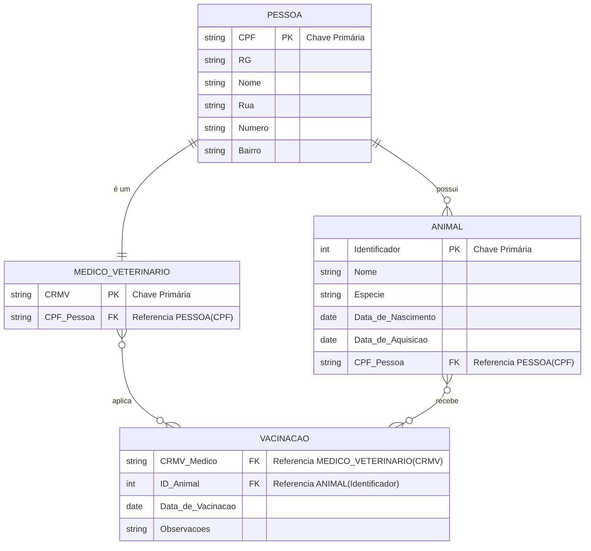

    ---

### Tabelas em Markdown

Esta seção descreve a estrutura das tabelas que seriam criadas em um banco de dados relacional.

#### Tabela: `Pessoa`
Armazena os dados de todas as pessoas, incluindo médicos veterinários.

| Coluna | Tipo de Dado | Restrição | Descrição |
| :--- | :--- | :--- | :--- |
| `CPF` | VARCHAR(14) | PK | Chave Primária (CPF da pessoa) |
| `RG` | VARCHAR(20) | | Documento de identidade |
| `Nome` | VARCHAR(255) | NOT NULL | Nome completo da pessoa |
| `Rua` | VARCHAR(255) | | Nome da rua do endereço |
| `Numero`| VARCHAR(10) | | Número do endereço |
| `Bairro`| VARCHAR(100) | | Bairro do endereço |

 

#### Tabela: `Medico_Veterinario`
Especialização da tabela `Pessoa` para armazenar dados exclusivos dos veterinários.

| Coluna | Tipo de Dado | Restrição | Descrição |
| :--- | :--- | :--- | :--- |
| `CRMV` | VARCHAR(20) | PK | Chave Primária (registro no conselho) |
| `CPF_Pessoa` | VARCHAR(14) | FK | Chave Estrangeira que referencia `Pessoa(CPF)` |

 

#### Tabela: `Animal`
Armazena os dados dos animais e a relação de posse.

| Coluna | Tipo de Dado | Restrição | Descrição |
| :--- | :--- | :--- | :--- |
| `Identificador` | INT | PK, AUTO_INCREMENT | Chave Primária (ID único do animal) |
| `Nome` | VARCHAR(100) | | Nome do animal |
| `Especie` | VARCHAR(100) | | Espécie do animal (ex: Canina, Felina) |
| `Data_de_Nascimento` | DATE | | Data de nascimento do animal |
| `Data_de_Aquisicao` | DATE | | Data em que a pessoa adquiriu o animal |
| `CPF_Pessoa` | VARCHAR(14) | FK, NOT NULL | Chave Estrangeira que referencia o dono em `Pessoa(CPF)` |

 

#### Tabela: `Vacinacao`
Tabela associativa para registrar as vacinas aplicadas nos animais pelos veterinários.

| Coluna | Tipo de Dado | Restrição | Descrição |
| :--- | :--- | :--- | :--- |
| `ID_Vacinacao` | INT | PK, AUTO_INCREMENT | Chave Primária da tabela |
| `CRMV_Medico` | VARCHAR(20) | FK, NOT NULL | Chave Estrangeira que referencia `Medico_Veterinario(CRMV)` |
| `ID_Animal` | INT | FK, NOT NULL | Chave Estrangeira que referencia `Animal(Identificador)` |
| `Data_de_Vacinacao` | DATE | NOT NULL | Data em que a vacina foi aplicada |
| `Observacoes` | TEXT | | Observações sobre a vacinação |

