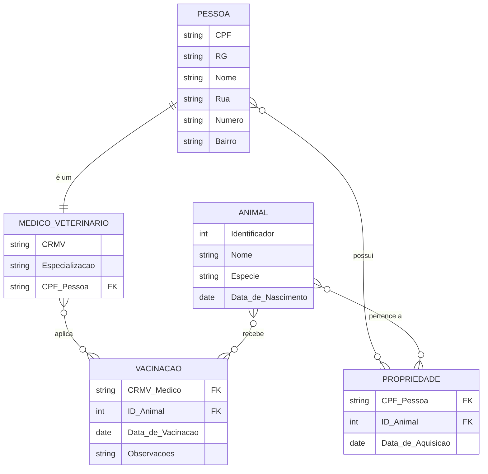

---

### Tabelas em Markdown (Atualizadas)

#### Tabela: `Pessoa`
Armazena os dados de todas as pessoas.

| Coluna | Tipo de Dado | Restrição | Descrição |
| :--- | :--- | :--- | :--- |
| `CPF` | VARCHAR(14) | | CPF da pessoa |
| `RG` | VARCHAR(20) | | Documento de identidade |
| `Nome` | VARCHAR(255) | NOT NULL | Nome completo da pessoa |
| `Rua` | VARCHAR(255) | | Nome da rua do endereço |
| `Numero`| VARCHAR(10) | | Número do endereço |
| `Bairro`| VARCHAR(100) | | Bairro do endereço |

 

#### Tabela: `Medico_Veterinario`
Dados exclusivos dos veterinários, incluindo a nova coluna `Especializacao`.

| Coluna | Tipo de Dado | Restrição | Descrição |
| :--- | :--- | :--- | :--- |
| `CRMV` | VARCHAR(20) | | Registro no conselho |
| `Especializacao` | VARCHAR(100) | | Área de especialização do veterinário |
| `CPF_Pessoa` | VARCHAR(14) | FK | Referencia `Pessoa(CPF)` |

 

#### Tabela: `Animal`
Armazena os dados dos animais. A informação de posse foi movida para a tabela `Propriedade`.

| Coluna | Tipo de Dado | Restrição | Descrição |
| :--- | :--- | :--- | :--- |
| `Identificador` | INT | | ID único do animal |
| `Nome` | VARCHAR(100) | | Nome do animal |
| `Especie` | VARCHAR(100) | | Espécie do animal (ex: Canina, Felina) |
| `Data_de_Nascimento` | DATE | | Data de nascimento do animal |

 

#### Tabela: `Propriedade` (Nova)
Tabela associativa para a relação N:N entre `Pessoa` e `Animal`.

| Coluna | Tipo de Dado | Restrição | Descrição |
| :--- | :--- | :--- | :--- |
| `CPF_Pessoa` | VARCHAR(14) | FK, NOT NULL | Referencia o dono em `Pessoa(CPF)` |
| `ID_Animal` | INT | FK, NOT NULL | Referencia o animal em `Animal(Identificador)` |
| `Data_de_Aquisicao`| DATE | | Data em que a pessoa adquiriu o animal |

 

#### Tabela: `Vacinacao`
Tabela associativa para registrar as vacinas aplicadas.

| Coluna | Tipo de Dado | Restrição | Descrição |
| :--- | :--- | :--- | :--- |
| `CRMV_Medico` | VARCHAR(20) | FK, NOT NULL | Referencia `Medico_Veterinario(CRMV)` |
| `ID_Animal` | INT | FK, NOT NULL | Referencia `Animal(Identificador)` |
| `Data_de_Vacinacao` | DATE | NOT NULL | Data em que a vacina foi aplicada |
| `Observacoes` | TEXT | | Observações sobre a vacinação |